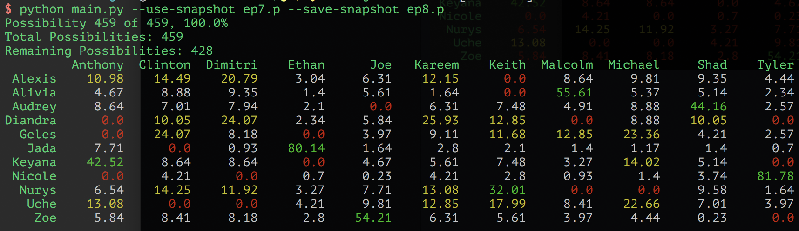

## Are You The Math

Calculating probabilities for [Are You The One](https://en.wikipedia.org/wiki/Are_You_the_One%3F)

Run with:
```bash
python main.py ---use-snapshot ep4.p --save-snapshot ep5.p
```

where the snapshot flags allow you to use or save a probabilities snapshot respectively. Starting from a previous snapshot will greatly speed up the calculation.

Match Ceremony and Truth Booth "inputs" are currently stored in the file and should be edited in place. The output should appear like so (current as of week 8):



### Citations

This idea was taken from http://areuthe.blogspot.com/
